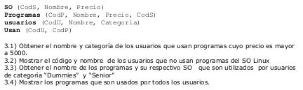

# Parcial 1
*Description*
The answers for the first partial exam from the Databases course

### Punto 1
* Modelo E-R.

### Punto 2
* Modelo Relacional ( especificando llaves primarias y foráneas )

### Punto 3
* Dados los siguientes esquemas, escribir las consultas en Algebra Relacional.

### Punto 4
