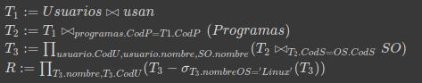

# Parcial 1
*Descripción*\
Respuestas parte practica primer examen parcial del curso de bases de datos.

**participantes**
* Ramirez O. Santiago - 1841391 - 2711
* Franco L. Matheo - 1830665 - 2711


### Punto 1
* Modelo E-R.


### Punto 2
* Modelo Relacional ( especificando llaves primarias y foráneas )
```
Libro ( PK(ISBN), titulo, year_publication, idioma, resumen, FK(sub_area_conocimiento), num_paginas, Autor, FK(Editorial))
  FK: sub_area_conocimiento REFERENCE A Codigo EN Sub_Area
  FK: Editorial REFERENCE A Codigo EN Editorial

Libros_Prestamo (FK(Num_Prestamo), FK(Libro_Prestamo))
  FK: Num_Prestamo REFERENCE A núm_consecutivo EN Préstamo_físico
  FK: Libro_Prestamo REFERENCE A ISBN EN Libro

Libro_Fisico ( PK(num_ejemplar), ubicación)

Libro_Digital ( Url, Formato_Archivo, Tamaño)

Autor ( PK(Codigo), Primer_Apellido, Segundo_Apellido, Primer_Nombre, Segundo_Nombre )

Editorial ( PK(codigo), Nombre, Pagina_web, Pais_Origen )

Area_conocimiento ( PK(Codigo), Nombre, Descripción )

Sub_Areas ( PK(codigo), Nombre, FK(Area_conocimiento) )
  FK: Area_conocimiento REFERENCE A Codigo EN Area_conocimiento

Autor_Libro (FK(Codigo_autor), FK(ISBN_Libro) )
  FK: Codigo_autor REFERENCE A codigo EN Autor
  FK: ISBN_Libro REFERENCE A ISBN EN Libro

Usuario ( PK(identificación), nombre, dirección, teléfono, email )

Estudiante ( carrera, universidad)

Profesor ( departamento, titulo, área)

Préstamo_físico ( PK(núm_consecutivo), fecha_inicio, fecha_fin, pedido, FK(tendero), FK(identificación) )
  FK: tendero REFERENCE A identificación EN Empleado
  FK: identificación REFERENCE A identificación EN Usuario

Préstamo_digital ( PK(num_cons), FK(usuario), fecha, hora, dir_IP)
  FK: Usuario REFERENCE A identificación EN Usuario

Empleado ( PK(identificación), nombre, cargo )

Multa ( PK(ID), FK(usuario_generador), fecha, valor_multa, descripción )
  FK: usuario_generador REFERENCE A identificación EN Usuario

Solicitud ( PK(núm), fecha, descripcion, FK(usuario), ISBN, titulo)
  FK: usuario REFERENCE A identificación EN Usuario
```

### Punto 3
* Dados los siguientes esquemas, escribir las consultas en Algebra Relacional.


  3.1 Obtener el nombre y categoría de los usuarios que usan programas cuyo precio es mayor a 5000.

    
    ```
    $ T_1 := Usuarios \Join Usan $ \
    $ T_2 := T_1 \Join_{Programas.CodP = T_1.CodP} Programas $ \
    $ T_3 := \sigma_{Precio > 5000} (T_2) $ \
    $ T_4 := \prod_{Usuarios.Nombre, Categoria} (T_3) $
    ```

  3.2 Mostrar el código y nombre de los usuarios que no usan programas del SO Linux

    
    ```
    $ T_1 := Usuarios \Join usan $\
    $ T_2 := T_1 \Join_{programas.CodP = T1.CodP} (Programas) $\
    $ T_3 := \prod_{usuario.CodU, usuario.nombre, SO.nombre}(T_2 \Join_{T_2.CodS=OS.CodS} SO)$\
    $ R := \prod_{T_3.nombre, T_3.CodU}(T_3 - \sigma_{T_3.nombreOS = 'Linux'}(T_3)) $
    ```
  3.3 Obtener el nombre de los programas y su respectivo SO que son utilizados por usuarios de categoría “Dummies” y “Senior”

    
    ```
    $ T_1 := \sigma_{Categoria=´Dummies´ \vee  Categoria='Senior'} (SO) $ \
    $ T_2 := T_1 \Join (Usan) $ \
    $ T_3 := Programas \Join_{Programas.CodS=SO.CodS} SO $ \
    $ T_4 := T_2 \Join_{T_2.CodP=T_3.CodP} T_3 $ \
    $ R := \prod_{Programa.Nombre, SO.Nombre} (T_4) $
    ```
  3.4 Mostrar los programas que son usados por todos los usuarios.

    
    ```
    $ T_1 := Usan \Join_{programa.CodP = Usan.CodP}(Programas) $\
    $ R := \prod_{programa.CodP, programa.Nombre, programa.Precio, programa.CodS}(T_1)$
    ```
### Punto 4

  4.1 El salario promedio de los profesores de la facultad de Salud
  ```
  select avg(SUELDO) as salario_promedio from PROFE where cod_facultad='sal';
  ```
  4.2 Código y nombre de asignaturas que se programaron en el periodo 2014-1 en el plan de Medicina
  ```
  select a.cod_a, a.nom_asig, a.plan_id
  from asignatura a, programacion p
  where a.plan_id = 3
  and p.periodo = '2014-1'
  and a.cod_a = p.cod_a ;
  ```
  4.3 Código y nombre de asignaturas que han dictado los profesores de categoría 3 y categoría 4
  ```
  (select a.COD_A, NOM_ASIG from ASIGNATURA a, programacion p where COD_P in (select COD_P from profe where CODCAT='3') and
                                                             a.COD_A=p.COD_A group by a.COD_A, NOM_ASIG)
 intersect
 (select a.COD_A, NOM_ASIG from ASIGNATURA a, programacion p where COD_P in (select COD_P from profe where CODCAT='4') and
                                                             a.COD_A=p.COD_A group by a.COD_A, NOM_ASIG);

  ```
  4.4 El salario promedio de los profesores agrupados por facultad
  ```
  select p.cod_facultad, avg(sueldo)  as salario_promedio
  from profe p
  group by p.cod_facultad;
  ```
  4.5 Código y nombre de asignaturas que nunca se han programado
  ```
  (select COD_A, NOM_ASIG from ASIGNATURA)
  except
  (select p.COD_A, NOM_ASIG from PROGRAMACION p, ASIGNATURA a  where p.COD_A=a.COD_A);

  ```
  4.6 Código y nombre de profesores que dictaron asignaturas de más de 3 créditos en el periodo 2013-1
  ```
  select p.cod_p, p.nom_prof , p2.periodo, a.creditos
  from profe p,asignatura a, programacion p2
  where a.creditos > 3 and p2.periodo ='2013-1'
  and p.cod_p = p2.cod_p
  and p2.cod_a = a.cod_a ;

  ```
  4.7 Código y nombre de asignaturas que han dado profesores de categoría 1 o categoría 2
  ```
  select p.COD_A, NOM_ASIG from PROGRAMACION p, ASIGNATURA a
  where COD_P in (select COD_P from PROFE where CODCAT in ('1', '2')) and
        p.COD_A=a.COD_A group by p.COD_A, NOM_ASIG;
  ```
  4.8 Código y nombre de asignaturas que han dado profesores de categoría 2 o categoría 3 pero no los de la categoría 1
  ```
  select distinct a.cod_a , a.nom_asig, p2.codcat
  from asignatura a, programacion p, profe p2
  where p2.codcat != '1'
  and a.cod_a = p.cod_a
  and p.cod_p = p2.cod_p
  order by p2.codcat ;
  ```  
  4.9 Código y Nombre de profesores de la facultad de Ingeniería que solo han dado clase en el periodo 2017-1
  ```
  (select p.COD_P, NOM_PROF from programacion p, profe pr where PERIODO='2017-1'
                                                            and cod_facultad='ing'
                                                            and p.COD_P=pr.COD_P group by p.COD_P, NOM_PROF)
  except
  (select p.COD_P, NOM_PROF from programacion p, profe pr where PERIODO in (select PERIODO from programacion where PERIODO<>'2017-1')
                                                  and cod_facultad='ing'
                                                  and p.cod_p=pr.COD_P group by p.COD_P, NOM_PROF);

  ```
  4.10 Código y Nombre de Profesores de la facultad de Ingeniería que dieron alguna asignatura de la facultad de salud
  ```
  select distinct p.cod_p, p.nom_prof, p.cod_facultad
  from profe p, programacion p2, asignatura a, plan p3
  where p.cod_facultad = 'ing'
  and a.plan_id = 3
  and p.cod_p = p2.cod_p
  and p2.cod_a = a.cod_a
  and a.plan_id = p3.plan_id;
  ```
